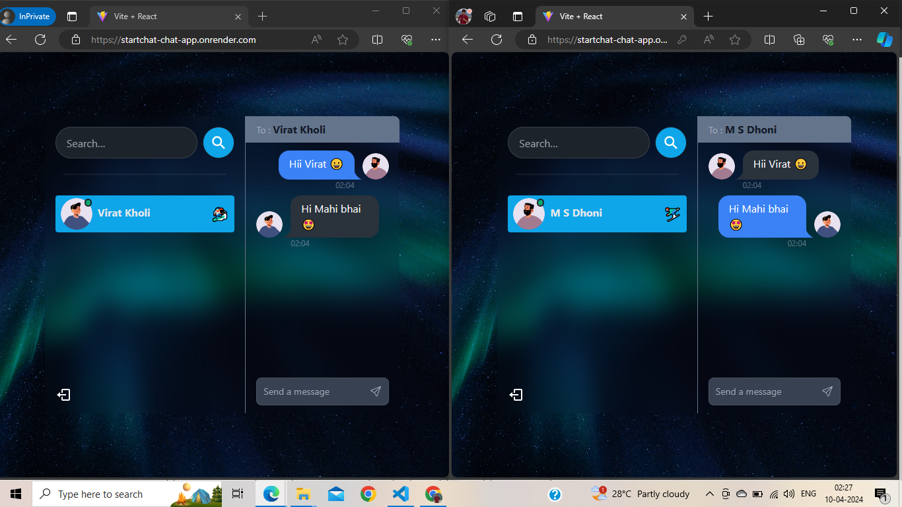

# Chat-App using MERN



This MERN stack chat application leverages the power of MongoDB, Express.js, React.js, and Node.js to provide seamless real-time communication. With JWT authentication, Socket.io for instant messaging, and Tailwind CSS for styling, this app offers a modern and intuitive chatting experience. 

## Features

- Real-time messaging with Socket.io
- End-to-end communication
- JWT authentication for secure user access
- Responsive design with Tailwind CSS
- Sound effects for incoming messages

## Technologies Used

- MongoDB
- Express.js
- React.js
- Node.js
- Socket.io
- JWT for authentication
- Tailwind CSS for styling

## Getting Started

To get started with the MERN Chat App, follow these steps:

1. Clone the repository:

   ```
   git clone <repository-url>
   ```

2. Install dependencies:

   ```
   cd frontend
   npm install
   cd ../backend
   npm install
   ```

3. Set up environment variables as needed.

4. Run the development server:

   ```
   cd frontend
   npm start
   cd ../backend
   npm start
   ```

5. Access the application via `http://localhost:3000` in your web browser.

## Additional Information

- Customize the sound effects by replacing the audio files located in the `frontend/src/assets/sounds` directory.
- Enhance security by adjusting JWT token configurations in the backend.
- Tailwind CSS utility classes enable rapid styling modifications.

## Support and Feedback

If you encounter any issues or have suggestions for improvement, please feel free to open an issue on GitHub. Your feedback is greatly appreciated!

Thank you for using the MERN Chat App. Happy chatting!

